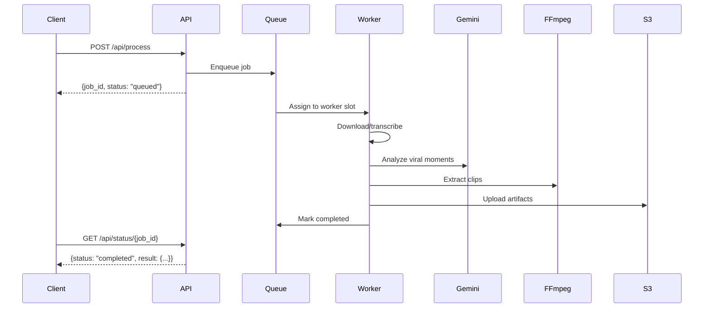

## POST /api/process

Submits a video (via URL or file upload) for asynchronous processing. The API will:

1. Download/upload the video
2. Transcribe audio with Whisper (word-level timestamps)
3. Detect scene boundaries with PySceneDetect
4. Use Gemini AI to identify 3-15 viral moments (15-60 seconds each)
5. Extract and vertically reframe clips to 9:16 format
6. Upload artifacts to S3 (silent background task)

<Note>
  This endpoint returns immediately with a `job_id`. Use `/api/status/{job_id}` to poll for completion.
</Note>

## Authentication

<ParamField header="X-Gemini-Key" type="string" required>
  Your Google Gemini API key for AI analysis
</ParamField>

## Request Parameters

### JSON Body (for URLs)

<ParamField body="url" type="string">
  YouTube URL or direct video link to process
</ParamField>

```json
{
  "url": "https://youtube.com/watch?v=dQw4w9WgXcQ"
}
```

### Form Data (for File Uploads)

<ParamField body="file" type="file">
  Video file to upload (max 2048 MB)
</ParamField>

<ParamField body="url" type="string">
  Alternative to file upload - YouTube URL
</ParamField>

<Note>
  You must provide **either** `url` or `file`, not both.
</Note>

## Response

<ResponseField name="job_id" type="string" required>
  Unique identifier for tracking this processing job
</ResponseField>

<ResponseField name="status" type="string" required>
  Initial status (always "queued" for new jobs)
</ResponseField>

```json
{
  "job_id": "550e8400-e29b-41d4-a716-446655440000",
  "status": "queued"
}
```

## Processing Flow



## Error Codes

| Code | Description |
|------|-------------|
| 400 | Missing `X-Gemini-Key` header |
| 400 | Neither `url` nor `file` provided |
| 413 | File exceeds 2048 MB limit |
| 500 | Processing error (download failed, API quota exceeded, etc.) |

## Examples

### Process YouTube Video

```bash
curl -X POST http://localhost:8000/api/process \
  -H "X-Gemini-Key: AIzaSy..." \
  -H "Content-Type: application/json" \
  -d '{
    "url": "https://youtube.com/watch?v=dQw4w9WgXcQ"
  }'
```

**Response:**
```json
{
  "job_id": "550e8400-e29b-41d4-a716-446655440000",
  "status": "queued"
}
```

### Upload Local Video

```bash
curl -X POST http://localhost:8000/api/process \
  -H "X-Gemini-Key: AIzaSy..." \
  -F "file=@/path/to/video.mp4"
```

### Python SDK Example

```python
import requests

url = "http://localhost:8000/api/process"
headers = {"X-Gemini-Key": "AIzaSy..."}

# Option 1: YouTube URL
response = requests.post(
    url,
    headers=headers,
    json={"url": "https://youtube.com/watch?v=dQw4w9WgXcQ"}
)

# Option 2: File Upload
with open("video.mp4", "rb") as f:
    response = requests.post(
        url,
        headers=headers,
        files={"file": f}
    )

job_id = response.json()["job_id"]
print(f"Job submitted: {job_id}")
```

### JavaScript/Fetch Example

```javascript
// Submit YouTube URL
const response = await fetch('http://localhost:8000/api/process', {
  method: 'POST',
  headers: {
    'X-Gemini-Key': 'AIzaSy...',
    'Content-Type': 'application/json'
  },
  body: JSON.stringify({
    url: 'https://youtube.com/watch?v=dQw4w9WgXcQ'
  })
});

const { job_id } = await response.json();
console.log('Job ID:', job_id);

// Upload file
const formData = new FormData();
formData.append('file', fileInput.files[0]);

const uploadResponse = await fetch('http://localhost:8000/api/process', {
  method: 'POST',
  headers: {
    'X-Gemini-Key': 'AIzaSy...'
  },
  body: formData
});
```

## Next Steps

After submitting a job:

1. [Poll job status](/api/status) to check progress
2. Once completed, [apply AI effects](/api/edit) to clips
3. [Add subtitles](/api/subtitle) with custom styling
4. [Translate videos](/api/translate) to other languages
5. [Post to social media](/api/social)

## Advanced Configuration

The processing pipeline is controlled server-side via environment variables:

- `MAX_CONCURRENT_JOBS`: Limit parallel processing (default: 5)
- `JOB_RETENTION_SECONDS`: Auto-cleanup delay (default: 3600)
- `MAX_FILE_SIZE_MB`: Upload size limit (default: 2048)