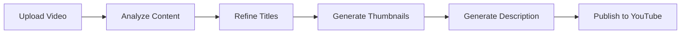

## Overview

The Thumbnail Studio API provides a complete workflow for creating viral YouTube thumbnails and optimized titles using Gemini AI. The API analyzes your video content and generates:

- **AI-suggested titles** based on video content and virality patterns
- **Custom thumbnails** with text overlays and visual effects
- **YouTube descriptions** with automatic chapter generation
- **Title refinement** through conversational AI

## Workflow



## POST /api/thumbnail/upload

Uploads a video and starts background Whisper transcription immediately. This pre-processes the video so subsequent operations are faster.

### Request Parameters

<ParamField body="file" type="file">
  Video file to upload (multipart/form-data)
</ParamField>

<ParamField body="url" type="string">
  YouTube URL to download (alternative to file upload)
</ParamField>

<Note>
  Provide **either** `file` or `url`, not both.
</Note>

### Response

<ResponseField name="session_id" type="string" required>
  Unique session identifier for this thumbnail studio session
</ResponseField>

```json
{
  "session_id": "thumb-550e8400-e29b-41d4-a716-446655440000"
}
```

### Example

```bash
# Upload local file
curl -X POST http://localhost:8000/api/thumbnail/upload \
  -F "file=@/path/to/video.mp4"

# Or YouTube URL
curl -X POST http://localhost:8000/api/thumbnail/upload \
  -F "url=https://youtube.com/watch?v=VIDEO_ID"
```

---

## POST /api/thumbnail/analyze

Analyzes a video and suggests viral YouTube titles using Gemini AI. Optionally uses pre-transcribed audio from `/upload` endpoint.

### Authentication

<ParamField header="X-Gemini-Key" type="string" required>
  Your Google Gemini API key
</ParamField>

### Request Parameters

<ParamField body="session_id" type="string">
  Session ID from `/api/thumbnail/upload` (for pre-transcribed videos)
</ParamField>

<ParamField body="file" type="file">
  Video file to analyze (if no session_id)
</ParamField>

<ParamField body="url" type="string">
  YouTube URL to analyze (if no session_id)
</ParamField>

<Note>
  If you used `/upload` first, only provide `session_id`. Otherwise, provide `file` or `url`.
</Note>

### Response

<ResponseField name="session_id" type="string" required>
  Session ID for continuing the workflow
</ResponseField>

<ResponseField name="titles" type="array" required>
  Array of AI-suggested viral titles (typically 5-10 options)
</ResponseField>

<ResponseField name="context" type="string" required>
  Summary of video content used for title generation
</ResponseField>

<ResponseField name="language" type="string" required>
  Detected video language (e.g., "en", "es")
</ResponseField>

<ResponseField name="recommended" type="array">
  Indices of recommended titles (highest virality potential)
</ResponseField>

```json
{
  "session_id": "thumb-550e8400-e29b-41d4-a716-446655440000",
  "titles": [
    "I Built an AI That Can Read Minds (It Actually Works)",
    "This AI Invention Will Change Everything in 2026",
    "Mind-Reading AI: The Future is Here",
    "You Won't Believe What This AI Can Do",
    "I Spent 30 Days Building a Mind-Reading AI"
  ],
  "context": "Video demonstrates a machine learning project that uses EEG signals to predict user intentions...",
  "language": "en",
  "recommended": [0, 2, 4]
}
```

### Example

```bash
# With pre-uploaded session
curl -X POST http://localhost:8000/api/thumbnail/analyze \
  -H "X-Gemini-Key: AIzaSy..." \
  -F "session_id=thumb-abc-123"

# Analyze new video
curl -X POST http://localhost:8000/api/thumbnail/analyze \
  -H "X-Gemini-Key: AIzaSy..." \
  -F "url=https://youtube.com/watch?v=VIDEO_ID"
```

---

## POST /api/thumbnail/titles

Refines title suggestions through conversational AI or accepts a manual title.

### Authentication

<ParamField header="X-Gemini-Key" type="string" required>
  Your Google Gemini API key
</ParamField>

### Request Body

<ParamField body="session_id" type="string">
  Session ID from previous analyze call (required for refinement mode)
</ParamField>

<ParamField body="message" type="string">
  User message for refinement (e.g., "make them shorter", "more clickbaity")
</ParamField>

<ParamField body="title" type="string">
  Manual title to use (skips AI refinement)
</ParamField>

<Note>
  Provide **either** `message` (for AI refinement) or `title` (for manual entry).
</Note>

### Response

<ResponseField name="session_id" type="string">
  Session ID (created if not provided)
</ResponseField>

<ResponseField name="titles" type="array" required>
  New array of refined titles or the manual title
</ResponseField>

```json
{
  "session_id": "thumb-550e8400-e29b-41d4-a716-446655440000",
  "titles": [
    "Mind-Reading AI That Actually Works",
    "I Built an AI Mind Reader in 30 Days",
    "This AI Reads Your Thoughts (No Clickbait)"
  ]
}
```

### Example - Refinement Mode

```bash
curl -X POST http://localhost:8000/api/thumbnail/titles \
  -H "X-Gemini-Key: AIzaSy..." \
  -H "Content-Type: application/json" \
  -d '{
    "session_id": "thumb-abc-123",
    "message": "make them shorter and more dramatic"
  }'
```

### Example - Manual Title

```bash
curl -X POST http://localhost:8000/api/thumbnail/titles \
  -H "X-Gemini-Key: AIzaSy..." \
  -H "Content-Type: application/json" \
  -d '{
    "title": "My Custom YouTube Title"
  }'
```

---

## POST /api/thumbnail/generate

Generates YouTube thumbnails with AI-powered text overlays and visual effects using Gemini image generation.

### Authentication

<ParamField header="X-Gemini-Key" type="string" required>
  Your Google Gemini API key
</ParamField>

### Request Parameters (Form Data)

<ParamField body="session_id" type="string" required>
  Session ID from previous steps
</ParamField>

<ParamField body="title" type="string" required>
  Title text to overlay on thumbnails
</ParamField>

<ParamField body="extra_prompt" type="string" default="">
  Additional prompt for customization (e.g., "dark background", "neon colors")
</ParamField>

<ParamField body="count" type="integer" default="3">
  Number of thumbnail variations to generate (1-6)
</ParamField>

<ParamField body="face" type="file">
  Face image to composite into thumbnail (optional)
</ParamField>

<ParamField body="background" type="file">
  Background image to use (optional)
</ParamField>

### Response

<ResponseField name="thumbnails" type="array" required>
  Array of generated thumbnail URLs
</ResponseField>

```json
{
  "thumbnails": [
    "/thumbnails/thumb_abc123_1.jpg",
    "/thumbnails/thumb_abc123_2.jpg",
    "/thumbnails/thumb_abc123_3.jpg"
  ]
}
```

### Example

```bash
curl -X POST http://localhost:8000/api/thumbnail/generate \
  -H "X-Gemini-Key: AIzaSy..." \
  -F "session_id=thumb-abc-123" \
  -F "title=Mind-Reading AI" \
  -F "extra_prompt=futuristic, neon blue and purple, dramatic lighting" \
  -F "count=3" \
  -F "face=@/path/to/face.jpg"
```

---

## POST /api/thumbnail/describe

Generates a YouTube description with automatic chapters based on video transcript.

### Authentication

<ParamField header="X-Gemini-Key" type="string" required>
  Your Google Gemini API key
</ParamField>

### Request Body

<ParamField body="session_id" type="string" required>
  Session ID from analyze step (must have transcript)
</ParamField>

<ParamField body="title" type="string" required>
  Video title to use in description
</ParamField>

### Response

<ResponseField name="description" type="string" required>
  Generated YouTube description with chapters
</ResponseField>

```json
{
  "description": "In this video, I show you how I built an AI that can read minds using EEG signals and machine learning.\n\nChapters:\n0:00 - Introduction\n1:23 - How EEG Works\n3:45 - Building the AI Model\n7:12 - Testing Results\n9:30 - Conclusion\n\n#ai #machinelearning #science"
}
```

### Example

```bash
curl -X POST http://localhost:8000/api/thumbnail/describe \
  -H "X-Gemini-Key: AIzaSy..." \
  -H "Content-Type: application/json" \
  -d '{
    "session_id": "thumb-abc-123",
    "title": "I Built an AI Mind Reader"
  }'
```

---

## POST /api/thumbnail/publish

Publishes the video to YouTube with the generated thumbnail and description via Upload-Post API. Returns immediately while upload happens in background.

### Request Parameters (Form Data)

<ParamField body="session_id" type="string" required>
  Session ID (must have original video)
</ParamField>

<ParamField body="title" type="string" required>
  YouTube video title
</ParamField>

<ParamField body="description" type="string" required>
  YouTube video description
</ParamField>

<ParamField body="thumbnail_url" type="string" required>
  URL of the thumbnail to use (from `/generate` response)
</ParamField>

<ParamField body="api_key" type="string" required>
  Upload-Post API key
</ParamField>

<ParamField body="user_id" type="string" required>
  Upload-Post user/profile username
</ParamField>

### Response

<ResponseField name="publish_id" type="string" required>
  Unique ID for tracking this publish job
</ResponseField>

<ResponseField name="status" type="string" required>
  Initial status (always "uploading")
</ResponseField>

```json
{
  "publish_id": "pub-xyz789",
  "status": "uploading"
}
```

### Example

```bash
curl -X POST http://localhost:8000/api/thumbnail/publish \
  -F "session_id=thumb-abc-123" \
  -F "title=I Built an AI Mind Reader" \
  -F "description=Check out this amazing project..." \
  -F "thumbnail_url=/thumbnails/thumb_abc123_1.jpg" \
  -F "api_key=YOUR_UPLOAD_POST_KEY" \
  -F "user_id=myusername"
```

---

## GET /api/thumbnail/publish/status/{publish_id}

Polls the status of a background publish job.

### Request

<ParamField path="publish_id" type="string" required>
  Publish ID from `/api/thumbnail/publish`
</ParamField>

### Response

<ResponseField name="status" type="string" required>
  Current status: `uploading`, `done`, or `failed`
</ResponseField>

<ResponseField name="result" type="object">
  Upload-Post API response (only if status is `done`)
</ResponseField>

<ResponseField name="error" type="string">
  Error message (only if status is `failed`)
</ResponseField>

```json
{
  "status": "done",
  "result": {
    "success": true,
    "uploadId": "up_abc123",
    "youtube_url": "https://youtube.com/watch?v=NEW_VIDEO_ID"
  },
  "error": null
}
```

### Example

```bash
curl http://localhost:8000/api/thumbnail/publish/status/pub-xyz789
```

---

## Complete Workflow Example

### Python SDK

```python
import requests
import time

API_BASE = "http://localhost:8000"
GEMINI_KEY = "AIzaSy..."
UPLOAD_POST_KEY = "YOUR_KEY"
USER_ID = "myusername"

# Step 1: Upload video (background transcription starts)
print("1. Uploading video...")
upload_resp = requests.post(
    f"{API_BASE}/api/thumbnail/upload",
    files={"file": open("video.mp4", "rb")}
)
session_id = upload_resp.json()["session_id"]
print(f"Session: {session_id}")

# Step 2: Analyze for titles (waits for transcription)
print("2. Analyzing content...")
analyze_resp = requests.post(
    f"{API_BASE}/api/thumbnail/analyze",
    headers={"X-Gemini-Key": GEMINI_KEY},
    data={"session_id": session_id}
)
titles = analyze_resp.json()["titles"]
print(f"Suggested titles: {titles}")

# Step 3: Refine titles
print("3. Refining titles...")
refine_resp = requests.post(
    f"{API_BASE}/api/thumbnail/titles",
    headers={"X-Gemini-Key": GEMINI_KEY},
    json={
        "session_id": session_id,
        "message": "make them shorter and more engaging"
    }
)
refined_titles = refine_resp.json()["titles"]
selected_title = refined_titles[0]
print(f"Selected: {selected_title}")

# Step 4: Generate thumbnails
print("4. Generating thumbnails...")
thumb_resp = requests.post(
    f"{API_BASE}/api/thumbnail/generate",
    headers={"X-Gemini-Key": GEMINI_KEY},
    data={
        "session_id": session_id,
        "title": selected_title,
        "extra_prompt": "dramatic, high contrast",
        "count": 3
    }
)
thumbnails = thumb_resp.json()["thumbnails"]
selected_thumbnail = thumbnails[0]
print(f"Generated: {len(thumbnails)} thumbnails")

# Step 5: Generate description
print("5. Generating description...")
desc_resp = requests.post(
    f"{API_BASE}/api/thumbnail/describe",
    headers={"X-Gemini-Key": GEMINI_KEY},
    json={
        "session_id": session_id,
        "title": selected_title
    }
)
description = desc_resp.json()["description"]
print(f"Description ready")

# Step 6: Publish to YouTube
print("6. Publishing to YouTube...")
publish_resp = requests.post(
    f"{API_BASE}/api/thumbnail/publish",
    data={
        "session_id": session_id,
        "title": selected_title,
        "description": description,
        "thumbnail_url": selected_thumbnail,
        "api_key": UPLOAD_POST_KEY,
        "user_id": USER_ID
    }
)
publish_id = publish_resp.json()["publish_id"]

# Step 7: Poll publish status
print("7. Waiting for upload...")
while True:
    status_resp = requests.get(
        f"{API_BASE}/api/thumbnail/publish/status/{publish_id}"
    )
    status_data = status_resp.json()
    
    if status_data["status"] == "done":
        print(f"✅ Published! {status_data['result']}")
        break
    elif status_data["status"] == "failed":
        print(f"❌ Failed: {status_data['error']}")
        break
    
    time.sleep(5)

print("Complete!")
```

---

## Error Codes

| Code | Description |
|------|-------------|
| 400 | Missing X-Gemini-Key header |
| 400 | Missing required parameters (file/url/session_id) |
| 404 | Session not found |
| 400 | No transcript segments available (analyze first) |
| 404 | Video file not found in session |
| 500 | Transcription failed |
| 500 | Gemini API error (quota, invalid key, etc.) |
| 500 | Upload-Post API error |

---

## Session Lifecycle

Sessions are stored in-memory and cleaned up after 1 hour of inactivity. A session contains:

- Original video file path
- Whisper transcript and segments
- Video duration and language
- Generated titles and conversation history
- Video context/summary

---

## Performance Notes

- **Upload**: Instant response, transcription runs in background
- **Analyze**: 30-60 seconds (includes Whisper if not pre-transcribed)
- **Titles Refinement**: 5-10 seconds per iteration
- **Thumbnail Generation**: 20-40 seconds for 3 thumbnails
- **Description**: 10-15 seconds
- **Publish**: Instant response, upload runs in background (5-10 minutes)

---

## Best Practices

1. **Use Upload First**: Call `/upload` before `/analyze` to pre-transcribe and save time
2. **Iterate on Titles**: Use multiple `/titles` refinement calls to perfect your title
3. **Test Thumbnails**: Generate 3-6 variations and A/B test
4. **Custom Prompts**: Use `extra_prompt` for brand-specific styling
5. **Face Overlays**: Upload a consistent face image for channel branding

---

## Next Steps

- [Process short clips](/api/process) for multi-platform distribution
- [Add subtitles](/api/subtitle) to improve watch time
- [Translate videos](/api/translate) to reach global audiences