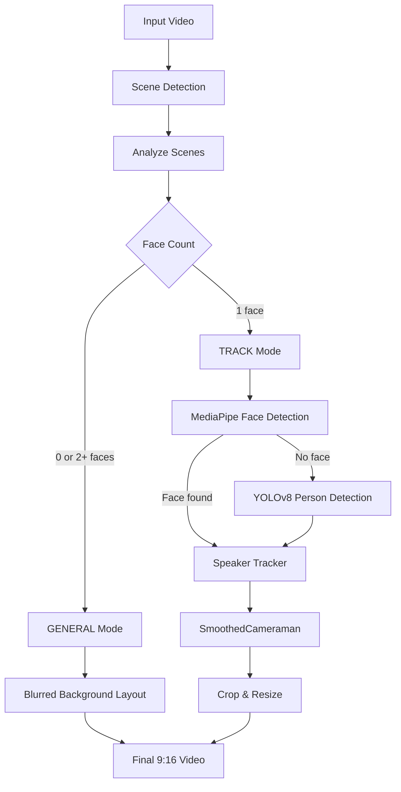

## Overview

OpenShorts uses a **dual-mode AI cropping strategy** to intelligently reframe horizontal videos into vertical 9:16 format. The system automatically detects whether to use **TRACK mode** (single subject) or **GENERAL mode** (groups/landscapes) on a per-scene basis.

## Dual-Mode Strategy

### Scene Analysis

Before processing, OpenShorts analyzes each scene to determine the optimal cropping strategy:

```python main.py
def analyze_scenes_strategy(video_path, scenes):
    """
    Analyzes each scene to determine if it should be TRACK (Single person) or GENERAL (Group/Wide).
    Returns list of strategies corresponding to scenes.
    """
    strategies = []
    
    for start, end in scenes:
        # Sample 3 frames (start, middle, end)
        frames_to_check = [
            start.get_frames() + 5,
            int((start.get_frames() + end.get_frames()) / 2),
            end.get_frames() - 5
        ]
        
        face_counts = []
        for f_idx in frames_to_check:
            cap.set(cv2.CAP_PROP_POS_FRAMES, f_idx)
            ret, frame = cap.read()
            if not ret: continue
            
            # Detect faces
            candidates = detect_face_candidates(frame)
            face_counts.append(len(candidates))
            
        avg_faces = sum(face_counts) / len(face_counts)
        
        # Strategy:
        # 0 faces -> GENERAL (Landscape/B-roll)
        # 1 face -> TRACK
        # > 1.2 faces -> GENERAL (Group)
        
        if avg_faces > 1.2 or avg_faces < 0.5:
            strategies.append('GENERAL')
        else:
            strategies.append('TRACK')
            
    return strategies
```

### TRACK Mode (Single Subject)

Used for talking heads, interviews, solo presentations:

- **MediaPipe Face Detection**: Lightweight BlazeFace model for fast face tracking
- **YOLOv8 Fallback**: Detects person bounding boxes when face is obscured
- **Heavy Tripod Stabilization**: Smooth camera movement with safe zone logic

### GENERAL Mode (Groups/Landscapes)

Used for multiple people, wide shots, B-roll:

- **Blurred Background**: Gaussian blur for cinematic effect
- **Fit-to-Width**: Original video scaled to fill width, centered vertically
- **No Tracking**: Static framing preserves full composition

```python main.py
def create_general_frame(frame, output_width, output_height):
    """
    Creates a 'General Shot' frame: 
    - Background: Blurred zoom of original
    - Foreground: Original video scaled to fit width, centered vertically.
    """
    orig_h, orig_w = frame.shape[:2]
    
    # 1. Background (Fill Height)
    bg_scale = output_height / orig_h
    bg_w = int(orig_w * bg_scale)
    bg_resized = cv2.resize(frame, (bg_w, output_height))
    
    # Crop center of background
    start_x = (bg_w - output_width) // 2
    background = bg_resized[:, start_x:start_x+output_width]
    
    # Blur background
    background = cv2.GaussianBlur(background, (51, 51), 0)
    
    # 2. Foreground (Fit Width)
    scale = output_width / orig_w
    fg_h = int(orig_h * scale)
    foreground = cv2.resize(frame, (output_width, fg_h))
    
    # 3. Overlay
    y_offset = (output_height - fg_h) // 2
    final_frame = background.copy()
    final_frame[y_offset:y_offset+fg_h, :] = foreground
    
    return final_frame
```

## Face Detection Pipeline

### MediaPipe (Primary)

Fast, lightweight face detection optimized for CPU:

```python main.py
import mediapipe as mp

mp_face_detection = mp.solutions.face_detection
face_detection = mp_face_detection.FaceDetection(
    model_selection=1,           # Full-range model
    min_detection_confidence=0.5
)

def detect_face_candidates(frame):
    """
    Returns list of all detected faces using lightweight FaceDetection.
    """
    height, width, _ = frame.shape
    rgb_frame = cv2.cvtColor(frame, cv2.COLOR_BGR2RGB)
    results = face_detection.process(rgb_frame)
    
    candidates = []
    
    if not results.detections:
        return []
        
    for detection in results.detections:
        bboxC = detection.location_data.relative_bounding_box
        x = int(bboxC.xmin * width)
        y = int(bboxC.ymin * height)
        w = int(bboxC.width * width)
        h = int(bboxC.height * height)
        
        candidates.append({
            'box': [x, y, w, h],
            'score': w * h  # Area as score
        })
            
    return candidates
```

### YOLOv8 (Fallback)

When face detection fails (e.g., person turned away, occluded):

```python main.py
from ultralytics import YOLO

model = YOLO('yolov8n.pt')

def detect_person_yolo(frame):
    """
    Fallback: Detect largest person using YOLO when face detection fails.
    Returns [x, y, w, h] of the person's 'upper body' approximation.
    """
    results = model(frame, verbose=False, classes=[0])  # class 0 is person
    
    best_box = None
    max_area = 0
    
    for result in results:
        boxes = result.boxes
        for box in boxes:
            x1, y1, x2, y2 = [int(i) for i in box.xyxy[0]]
            w = x2 - x1
            h = y2 - y1
            area = w * h
            
            if area > max_area:
                max_area = area
                # Focus on the top 40% of the person (head/chest) for framing
                face_h = int(h * 0.4)
                best_box = [x1, y1, w, face_h]
                
    return best_box
```

## "Heavy Tripod" Stabilization

The `SmoothedCameraman` class prevents jittery tracking with a "safe zone" approach:

```python main.py
class SmoothedCameraman:
    """
    Handles smooth camera movement.
    Simplified Logic: "Heavy Tripod"
    Only moves if the subject leaves the center safe zone.
    Moves slowly and linearly.
    """
    def __init__(self, output_width, output_height, video_width, video_height):
        self.output_width = output_width
        self.output_height = output_height
        self.video_width = video_width
        self.video_height = video_height
        
        # Initial State
        self.current_center_x = video_width / 2
        self.target_center_x = video_width / 2
        
        # Safe Zone: 25% of the crop width
        # As long as the target is within this zone, DO NOT MOVE.
        self.safe_zone_radius = self.crop_width * 0.25

    def get_crop_box(self, force_snap=False):
        """
        Returns the (x1, y1, x2, y2) for the current frame.
        """
        if force_snap:
            self.current_center_x = self.target_center_x
        else:
            diff = self.target_center_x - self.current_center_x
            
            # SIMPLIFIED LOGIC:
            # 1. Is the target outside the safe zone?
            if abs(diff) > self.safe_zone_radius:
                # 2. If yes, move towards it slowly
                direction = 1 if diff > 0 else -1
                
                # Speed: slow pan or fast re-frame
                if abs(diff) > self.crop_width * 0.5:
                    speed = 15.0  # Fast re-frame
                else:
                    speed = 3.0   # Slow, steady pan
                
                self.current_center_x += direction * speed
                
                # Check if we overshot (prevent oscillation)
                new_diff = self.target_center_x - self.current_center_x
                if (direction == 1 and new_diff < 0) or (direction == -1 and new_diff > 0):
                    self.current_center_x = self.target_center_x
            
            # If inside safe zone, DO NOTHING (Stationary Camera)
        
        # Clamp and return crop box
        # ...
```

<Info>
**Safe Zone**: The camera only moves when the subject drifts more than 25% of the frame width from center. This prevents micro-adjustments that cause jitter.
</Info>

## Speaker Tracking (Anti-Jitter)

The `SpeakerTracker` prevents rapid switching between multiple faces:

```python main.py
class SpeakerTracker:
    """
    Tracks speakers over time to prevent rapid switching and handle temporary obstructions.
    """
    def __init__(self, stabilization_frames=15, cooldown_frames=30):
        self.active_speaker_id = None
        self.speaker_scores = {}  # {id: score}
        self.stabilization_threshold = stabilization_frames  # Frames needed to confirm a new speaker
        self.switch_cooldown = cooldown_frames  # Minimum frames before switching again

    def get_target(self, face_candidates, frame_number, width):
        """
        Decides which face to focus on.
        face_candidates: list of {'box': [x,y,w,h], 'score': float}
        """
        # 1. Match faces to known IDs (simple distance tracking)
        # 2. Update Scores with decay
        # 3. Determine Best Speaker with hysteresis
        
        # Hysteresis: HUGE Bonus for current active speaker
        if pid == self.active_speaker_id:
            total_score *= 3.0  # Sticky factor
        
        # 4. Decide Switch (with cooldown)
        if frame_number - self.last_switch_frame < self.switch_cooldown:
            # Stay locked on current speaker
            return old_speaker_box
            
        return best_candidate['box']
```

<Check>
**Hysteresis Factor**: The active speaker gets a 3x score bonus, making it "sticky" and preventing rapid camera switches during group conversations.
</Check>

## Processing Pipeline



## Scene Change Handling

Camera snaps to new position on scene cuts to avoid panning from previous scene:

```python main.py
# Snap camera on scene change
is_scene_start = (frame_number == scene_boundaries[current_scene_index][0])
x1, y1, x2, y2 = cameraman.get_crop_box(force_snap=is_scene_start)
```

## Performance

- **MediaPipe**: ~30-60 FPS on CPU
- **YOLOv8n**: ~15-30 FPS on CPU (fallback only)
- **Detection Frequency**: Every 2nd frame to optimize speed

```python
if frame_number % 2 == 0:
    candidates = detect_face_candidates(frame)
    target_box = speaker_tracker.get_target(candidates, frame_number, original_width)
```

## Related

<CardGroup cols={2}>
  <Card title="Viral Detection" icon="sparkles" href="/features/viral-detection">
    AI-powered moment identification
  </Card>
  <Card title="Hook Overlays" icon="text" href="/guides/editing-clips">
    Add viral text overlays to clips
  </Card>
</CardGroup>