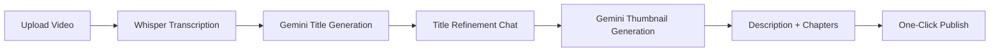

## Overview

OpenShorts provides a complete **YouTube publishing pipeline** powered by Gemini AI. The system generates viral titles, creates eye-catching thumbnails, writes SEO-optimized descriptions with chapters, and publishes directly to YouTube—all from a single interface.

## Workflow Overview



## 1. AI Title Generation

Gemini analyzes the video and transcript to suggest 10 viral YouTube titles:

```python thumbnail.py
def analyze_video_for_titles(api_key, video_path, transcript=None):
    """
    Transcribes a video and uses Gemini to suggest viral YouTube titles.
    If transcript is provided, skips Whisper transcription.
    """
    if transcript is None:
        from main import transcribe_video
        transcript = transcribe_video(video_path)
    
    client = genai.Client(api_key=api_key)
    
    # Upload video to Gemini
    file_upload = client.files.upload(file=video_path)
    while True:
        file_info = client.files.get(name=file_upload.name)
        if file_info.state == "ACTIVE":
            break
        time.sleep(2)
    
    prompt = f"""You are a YouTube title expert who creates viral, click-worthy titles.

Analyze this video and its transcript, then suggest 10 YouTube titles that would maximize CTR (click-through rate).

TRANSCRIPT:
{transcript['text']}

RULES:
- Titles must be under 70 characters
- Use power words, curiosity gaps, and emotional triggers
- Mix styles: how-to, listicle, story-driven, controversial, question-based
- Make them specific to the actual content, not generic
- Include numbers where appropriate
- Titles should be in the SAME LANGUAGE as the video transcript

Also provide a brief summary of the video content (2-3 sentences).

After generating all 10 titles, pick the TOP 2 you most recommend and explain concisely WHY (CTR potential, emotional hook, uniqueness, etc.).

OUTPUT JSON:
{{
    "titles": ["title1", "title2", ...],
    "transcript_summary": "Brief summary...",
    "language": "{transcript['language']}",
    "recommended": [
        {{"index": 0, "reason": "Why this title is best..."}},
        {{"index": 3, "reason": "Why this title is second best..."}}
    ]
}}"""
    
    response = client.models.generate_content(
        model="gemini-2.5-flash",
        contents=[file_upload, prompt],
        config=types.GenerateContentConfig(
            response_mime_type="application/json"
        )
    )
    
    return json.loads(response.text)
```

**Example Response**:

```json
{
  "titles": [
    "I Automated My Entire Workflow with AI (10 Hours Saved Per Week)",
    "This AI Tool Changed How I Work Forever",
    "How to Build an AI Agent in 15 Minutes (No Code)",
    "The AI Productivity System That Actually Works",
    "Stop Wasting Time: My Complete AI Automation Stack",
    "I Tested 20 AI Tools - Only These 3 Matter",
    "AI Replaced 80% of My Job (Here's What I Do Now)",
    "The Future of Work is Here (And It's Terrifying)",
    "From 60 Hours to 20 Hours: My AI Transformation",
    "Why Everyone Should Learn AI Automation in 2026"
  ],
  "transcript_summary": "Video demonstrates a complete AI automation workflow using n8n and OpenAI to automate content creation, email responses, and social media scheduling. Shows step-by-step setup and real results.",
  "language": "en",
  "recommended": [
    {
      "index": 0,
      "reason": "Specific number hook (10 hours) + outcome-focused. High CTR potential for productivity niche."
    },
    {
      "index": 5,
      "reason": "Curiosity gap + list format. 'Only These 3 Matter' creates strong desire to know which tools."
    }
  ]
}
```

## 2. Title Refinement Chat

Users can refine titles through conversational AI:

```python thumbnail.py
def refine_titles(api_key, context, user_message, conversation_history=None):
    """
    Takes video context + user feedback and returns refined title suggestions.
    """
    client = genai.Client(api_key=api_key)
    
    history_text = ""
    if conversation_history:
        for msg in conversation_history:
            role = msg.get("role", "user")
            history_text += f"\n{role.upper()}: {msg['content']}"
    
    prompt = f"""You are a YouTube title expert. Based on the video context and the user's feedback, suggest 8 new refined YouTube titles.

VIDEO CONTEXT:
{context}

CONVERSATION HISTORY:{history_text}

USER'S NEW REQUEST:
{user_message}

RULES:
- Titles must be under 70 characters
- Incorporate the user's feedback/direction
- Keep titles viral and click-worthy
- If the user asks for a specific style, follow it

OUTPUT JSON:
{{
    "titles": ["title1", "title2", ...]
}}"""
    
    response = client.models.generate_content(
        model="gemini-2.5-flash",
        contents=[prompt],
        config=types.GenerateContentConfig(
            response_mime_type="application/json"
        )
    )
    
    return json.loads(response.text)
```

**API Endpoint**:

```python app.py
@app.post("/api/thumbnail/titles")
async def thumbnail_titles(
    req: ThumbnailTitlesRequest,
    x_gemini_key: Optional[str] = Header(None, alias="X-Gemini-Key")
):
    """Refine title suggestions or accept a manual title."""
    session = thumbnail_sessions[req.session_id]
    
    # Add user message to conversation history
    session["conversation"].append({"role": "user", "content": req.message})
    
    result = await loop.run_in_executor(
        None,
        refine_titles,
        api_key,
        session["context"],
        req.message,
        session["conversation"]
    )
    
    new_titles = result.get("titles", [])
    session["titles"] = new_titles
    session["conversation"].append({"role": "assistant", "content": json.dumps(new_titles)})
    
    return {"titles": new_titles}
```

**Example Chat**:

```
User: "Make them more controversial"
AI: [
  "AI Will Take Your Job (And That's a Good Thing)",
  "Why I Quit My $200k Job for AI Automation",
  "The Uncomfortable Truth About AI and Employment"
]

User: "More beginner-friendly"
AI: [
  "AI for Complete Beginners: Start Here",
  "Your First AI Automation in 10 Minutes",
  "AI Basics Everyone Should Know in 2026"
]
```

## 3. Thumbnail Generation

Gemini's image generation creates YouTube thumbnails with optional face/background overlays:

```python thumbnail.py
def generate_thumbnail(
    api_key, 
    title, 
    session_id, 
    face_image_path=None, 
    bg_image_path=None, 
    extra_prompt="", 
    count=3, 
    video_context=""
):
    """
    Generates YouTube thumbnails using Gemini image generation.
    Returns list of saved image paths (relative URLs).
    """
    client = genai.Client(api_key=api_key)
    
    output_dir = os.path.join("output", "thumbnails", session_id)
    os.makedirs(output_dir, exist_ok=True)
    
    prompt_parts = []
    
    # Add face image if provided
    if face_image_path and os.path.exists(face_image_path):
        face_img = Image.open(face_image_path)
        prompt_parts.append(face_img)
    
    # Add background image if provided
    if bg_image_path and os.path.exists(bg_image_path):
        bg_img = Image.open(bg_image_path)
        prompt_parts.append(bg_img)
    
    text_prompt = f"""Generate a professional, eye-catching YouTube thumbnail image.

VIDEO TITLE (for reference — do NOT put the full title on the thumbnail): "{title}"

VIDEO CONTEXT:
{video_context}

TEXT ON THE THUMBNAIL:
- Based on the title AND context, create a SHORT visual hook: 1 to 5 words maximum
- Examples: "$10K EN 30 DÍAS", "ESTO FUNCIONA", "NO LO SABÍAS", "GRATIS 🔥"
- Use ALL CAPS for maximum impact, split into 2-3 lines

{extra_prompt}

DESIGN REQUIREMENTS:
- The text MUST be large, bold, and high-contrast (readable at small sizes)
- Use vibrant, eye-catching colors that match the video's mood
- Professional YouTube thumbnail aesthetic
- Clean composition — text and face/subject as clear focal points
- NO clutter, NO small text, NO watermarks"""
    
    if face_image_path:
        text_prompt += "\n- Include the provided face/person prominently with an exaggerated expression (surprise, excitement, shock)"
    
    prompt_parts.append(text_prompt)
    
    thumbnails = []
    for i in range(count):
        response = client.models.generate_content(
            model="gemini-3-pro-image-preview",
            contents=prompt_parts,
            config=types.GenerateContentConfig(
                response_modalities=["TEXT", "IMAGE"],
                image_config=types.ImageConfig(
                    aspect_ratio="16:9",
                    image_size="2K"
                )
            )
        )
        
        for part in response.parts:
            if image := part.as_image():
                filename = f"thumb_{i + 1}.jpg"
                filepath = os.path.join(output_dir, filename)
                image.save(filepath)
                thumbnails.append(f"/thumbnails/{session_id}/{filename}")
                break
    
    return thumbnails
```

**API Endpoint**:

```python app.py
@app.post("/api/thumbnail/generate")
async def thumbnail_generate(
    session_id: str = Form(...),
    title: str = Form(...),
    extra_prompt: str = Form(""),
    count: int = Form(3),
    face: Optional[UploadFile] = File(None),
    background: Optional[UploadFile] = File(None),
    x_gemini_key: Optional[str] = Header(None, alias="X-Gemini-Key")
):
    # Save uploaded images
    face_path = None
    bg_path = None
    
    if face and face.filename:
        face_path = os.path.join(thumb_upload_dir, f"face_{face.filename}")
        with open(face_path, "wb") as f:
            f.write(await face.read())
    
    if background and background.filename:
        bg_path = os.path.join(thumb_upload_dir, f"bg_{background.filename}")
        with open(bg_path, "wb") as f:
            f.write(await background.read())
    
    # Generate thumbnails
    thumbnails = await loop.run_in_executor(
        None,
        generate_thumbnail,
        api_key,
        title,
        session_id,
        face_path,
        bg_path,
        extra_prompt,
        count,
        video_context
    )
    
    return {"thumbnails": thumbnails}
```

## 4. Description with Chapters

Gemini generates SEO-optimized descriptions with automatic chapter markers:

```python thumbnail.py
def generate_youtube_description(api_key, title, transcript_segments, language, video_duration):
    """
    Uses Gemini to generate a YouTube description with chapter markers from transcript segments.
    """
    client = genai.Client(api_key=api_key)
    
    # Format segments for the prompt
    formatted_segments = []
    for seg in transcript_segments:
        start = seg.get("start", 0)
        mins = int(start // 60)
        secs = int(start % 60)
        timestamp = f"{mins}:{secs:02d}"
        formatted_segments.append(f"[{timestamp}] {seg.get('text', '').strip()}")
    
    segments_text = "\n".join(formatted_segments)
    
    prompt = f"""You are a YouTube SEO expert. Generate a complete YouTube video description.

VIDEO TITLE: "{title}"
VIDEO LANGUAGE: {language}
VIDEO DURATION: {video_duration}

TRANSCRIPT WITH TIMESTAMPS:
{segments_text}

REQUIREMENTS:
1. Write the description in the SAME LANGUAGE as the video ({language})
2. Start with a compelling 2-3 sentence summary/hook
3. Add relevant CTAs (subscribe, like, comment)
4. Generate YouTube CHAPTERS based on the transcript timestamps:
   - First chapter MUST start at 0:00
   - Minimum 3 chapters, each at least 10 seconds apart
   - Chapter titles should be concise and descriptive
   - Format: 0:00 Chapter Title
5. Add 5-10 relevant hashtags at the end
6. Keep the total description under 5000 characters

OUTPUT: Return ONLY the description text (no JSON wrapper)."""
    
    response = client.models.generate_content(
        model="gemini-2.5-flash",
        contents=[prompt],
    )
    
    description = response.text.strip()
    return {"description": description}
```

**Example Output**:

```
Discover how I automated my entire workflow using AI and saved 10 hours every week. In this video, I'll show you the exact tools and step-by-step process to build your own AI automation system—no coding required!

🔔 Subscribe for more AI productivity hacks!
👍 Like if you found this helpful!
💬 Comment your biggest time-waster and I'll suggest an AI solution!

CHAPTERS:
0:00 Introduction
1:23 The Problem: Wasting 10 Hours Per Week
3:45 Setting Up n8n for Automation
7:12 Connecting OpenAI API
10:30 Building the Workflow
14:15 Testing & Results
17:40 Conclusion & Next Steps

🔗 LINKS:
- n8n: https://n8n.io
- OpenAI: https://openai.com
- My Full Guide: [link]

#AI #Automation #Productivity #n8n #OpenAI #AITools #WorkflowAutomation #TechTutorial #TimeManagement #AIAgent
```

## 5. One-Click Publishing

Publish directly to YouTube via Upload-Post API:

```python app.py
@app.post("/api/thumbnail/publish")
async def thumbnail_publish(
    background_tasks: BackgroundTasks,
    session_id: str = Form(...),
    title: str = Form(...),
    description: str = Form(...),
    thumbnail_url: str = Form(...),
    api_key: str = Form(...),
    user_id: str = Form(...),
):
    """Kick off a background upload to YouTube and return immediately."""
    session = thumbnail_sessions[session_id]
    video_path = session.get("video_path")
    
    # Resolve thumbnail path
    thumb_path = os.path.join(OUTPUT_DIR, thumbnail_url.lstrip("/"))
    
    publish_id = str(uuid.uuid4())
    publish_jobs[publish_id] = {"status": "uploading", "result": None, "error": None}
    
    def do_upload():
        try:
            upload_url = "https://api.upload-post.com/api/upload"
            headers = {"Authorization": f"Apikey {api_key}"}
            data_payload = {
                "user": user_id,
                "platform[]": ["youtube"],
                "title": title,
                "async_upload": "true",
                "youtube_title": title,
                "youtube_description": description,
                "privacyStatus": "public",
            }
            
            # Read video and thumbnail
            with open(video_path, "rb") as vf, open(thumb_path, "rb") as tf:
                files = {
                    "video": (os.path.basename(video_path), vf.read(), "video/mp4"),
                    "thumbnail": (os.path.basename(thumb_path), tf.read(), "image/jpeg")
                }
                
                with httpx.Client(timeout=300.0) as client:
                    response = client.post(upload_url, headers=headers, data=data_payload, files=files)
            
            if response.status_code in [200, 201, 202]:
                publish_jobs[publish_id] = {"status": "completed", "result": response.json(), "error": None}
            else:
                publish_jobs[publish_id] = {"status": "failed", "result": None, "error": response.text}
                
        except Exception as e:
            publish_jobs[publish_id] = {"status": "failed", "result": None, "error": str(e)}
    
    background_tasks.add_task(do_upload)
    
    return {"publish_id": publish_id, "status": "uploading"}
```

## Complete API Flow

```javascript JavaScript Example
// 1. Upload video and start background transcription
const uploadResp = await fetch('/api/thumbnail/upload', {
  method: 'POST',
  body: formData  // contains video file or YouTube URL
});
const { session_id } = await uploadResp.json();

// 2. Analyze video for title suggestions (Whisper completes in background)
const analyzeResp = await fetch('/api/thumbnail/analyze', {
  method: 'POST',
  headers: { 'X-Gemini-Key': geminiKey },
  body: JSON.stringify({ session_id })
});
const { titles, context, recommended } = await analyzeResp.json();

// 3. (Optional) Refine titles via chat
const refineResp = await fetch('/api/thumbnail/titles', {
  method: 'POST',
  headers: { 'X-Gemini-Key': geminiKey },
  body: JSON.stringify({
    session_id,
    message: "Make them more beginner-friendly"
  })
});
const { titles: refinedTitles } = await refineResp.json();

// 4. Generate thumbnails
const thumbResp = await fetch('/api/thumbnail/generate', {
  method: 'POST',
  headers: { 'X-Gemini-Key': geminiKey },
  body: formDataWithFaceAndTitle
});
const { thumbnails } = await thumbResp.json();

// 5. Generate description with chapters
const descResp = await fetch('/api/thumbnail/describe', {
  method: 'POST',
  headers: { 'X-Gemini-Key': geminiKey },
  body: JSON.stringify({ session_id, title: selectedTitle })
});
const { description } = await descResp.json();

// 6. Publish to YouTube
const publishResp = await fetch('/api/thumbnail/publish', {
  method: 'POST',
  body: new FormData({
    session_id,
    title: selectedTitle,
    description,
    thumbnail_url: thumbnails[0],
    api_key: uploadPostKey,
    user_id: userId
  })
});
const { publish_id } = await publishResp.json();
```

## Background Transcription Optimization

The system starts Whisper transcription immediately on upload to minimize wait time:

```python app.py
@app.post("/api/thumbnail/upload")
async def thumbnail_upload(file: UploadFile, url: Optional[str]):
    session_id = str(uuid.uuid4())
    transcript_event = asyncio.Event()
    
    thumbnail_sessions[session_id] = {
        "transcript_event": transcript_event,
        "transcript_ready": False
    }
    
    async def run_background_whisper():
        try:
            from main import transcribe_video
            transcript = await loop.run_in_executor(None, transcribe_video, video_path)
            
            thumbnail_sessions[session_id].update({
                "transcript_ready": True,
                "transcript": transcript
            })
        finally:
            transcript_event.set()
    
    asyncio.create_task(run_background_whisper())
    
    return {"session_id": session_id}
```

When `/api/thumbnail/analyze` is called, it waits for transcription if needed:

```python
if session_id in thumbnail_sessions:
    transcript_event = session["transcript_event"]
    await transcript_event.wait()  # Wait for background Whisper
    pre_transcript = session["transcript"]
```

<Info>
**Performance Benefit**: Transcription runs in parallel with user interactions (selecting video, reviewing UI). Most users won't notice the wait.
</Info>

## Related

<CardGroup cols={2}>
  <Card title="Social Posting" icon="share-nodes" href="/features/social-posting">
    Multi-platform distribution
  </Card>
  <Card title="Viral Detection" icon="sparkles" href="/features/viral-detection">
    AI moment identification
  </Card>
</CardGroup>